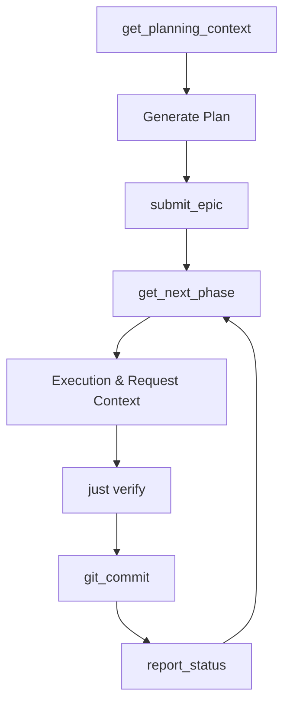

# **Jitsu: JIT Context & Workflow Orchestrator**

**Jitsu** (実 / "Truth/Substance") is a high-performance MCP (Model Context Protocol) server designed to eliminate "Prompt Debt" and "Context Drift" in AI-driven development. It serves as an intelligent bridge between a Python-based orchestration layer and sandboxed IDE agents (such as Antigravity, Cursor, or Windsurf).

By shifting the heavy lifting of context preparation to Python, Jitsu ensures that agents receive only the "ground truth" of the codebase **Just-In-Time (JIT)**. This radically reduces token usage, prevents hallucination, and enables agents to work within massive repositories without overwhelming their context windows.

---

## **Core Philosophy**

1. **The Code is the Source of Truth:** Documents lie; code does not. Jitsu uses reflection, AST analysis, and schema extraction to provide the absolute current state of the project.
2. **Strict Typed Directives:** Agent instructions are validated Pydantic models (`AgentDirective`). They include explicit "Definitions of Done," verification commands, and strictly forbidden anti-patterns.
3. **Context-on-Demand (Progressive Disclosure):** Provide the agent with exactly what it needs for the *current* task. Agents can request additional context dynamically.
4. **Self-Orchestration:** Jitsu enables an autonomous loop where agents can plan their own tasks, queue phases, and report progress without human intervention.
5. **Security via Lifecycle:** All destructive actions (commits, pushes) are governed by a "Just-based Git Lifecycle" to ensure project integrity.

---

## **The 1.0 Architecture**

Jitsu operates through a four-layer architecture designed to maximize fidelity and autonomy.

### **Layer 1: Strict Pydantic Models (The Core)**

The foundation of Jitsu is a set of rigorous Pydantic models that define the communication protocol between the orchestrator and the agent.

* **`AgentDirective`**: Defines a work phase, including instructions, anti-patterns, and context targets.
* **`PhaseReport`**: Structured feedback from the agent, including artifacts and verification results.
* **`TargetResolutionMode`**: Governs how the ContextCompiler handles specific files (AUTO, STRUCTURE_ONLY, SCHEMA_ONLY, FULL_SOURCE).

### **Layer 2: AST-First Providers (The Eyes)**

Providers are specialized modules that extract information from the filesystem and environment.

* **`ASTProvider`**: Strips implementation details from Python files, providing structural skeletons. **Token Savings: 70-90%**.
* **`PydanticProvider`**: Uses live reflection to extract JSON schemas from models.
* **`GitProvider`**: Provides snapshots of repository status and diffs.
* **`DirectoryTreeProvider`**: Generates visual representations of the project structure.

### **Layer 3: ContextCompiler with AUTO Fallback (The Engine)**

The `ContextCompiler` weaves together directives and live codebase state into optimized Markdown prompts.

* **Intelligence**: When set to `AUTO`, the compiler follows a priority-based resolution policy:
  1. **AST**: If it's a `.py` file, provide structure.
  2. **Pydantic**: If it's a symbol, provide its schema.
  3. **Tree**: If it's a directory, provide a visual structure.
  4. **FileState**: Fallback to full source text.
* **Verification Manifests**: Every prompt includes a manifest describing exactly how each context target was resolved, ensuring the agent knows its "ground truth" boundaries.

### **Layer 4: Self-Orchestrating MCP Server (The Gateway)**

The top layer exposes Jitsu to IDEs via MCP and handles the autonomous execution loop.

* **Planning & Execution**: Tools like `jitsu_get_planning_context` and `jitsu_submit_epic` allow agents to gather repository intelligence and queue their own future phases.
* **Managed Queue**: A robust, stateful queue handles the sequence of tasks, ensuring the agent remains focused on one atomic phase at a time.
* **Just-based Git Lifecycle**: Destructive operations are delegated to `just` recipes (`just commit`, `just sync`), providing a controlled security boundary for repository changes.

---

## **The Autonomous Workflow Loop**

1. **Plan**: Use `jitsu_get_planning_context()` to understand the repo and rules.
2. **Submit**: Use `jitsu_submit_epic()` to queue the planned work phases.
3. **Pull**: Call `jitsu_get_next_phase()` to receive the first objective.
4. **Execute**: Modify the code as directed. Use `jitsu_request_context()` for missing info.
5. **Verify**: Run `just verify` to ensure tests, linting, and types are passing.
6. **Commit**: Use `jitsu_git_commit` to stage and commit changes.
7. **Report**: Call `jitsu_report_status()` to mark the phase as successful and move to the next.

