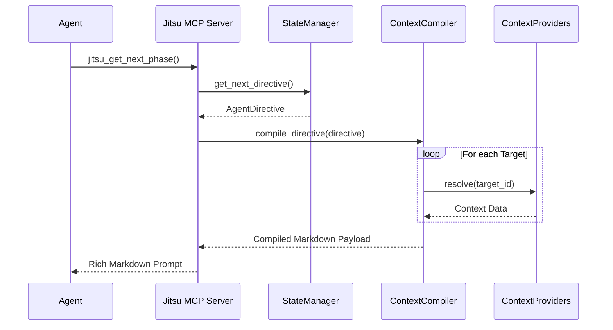

# `jitsu_get_next_phase`

The `jitsu_get_next_phase` tool is the primary entry point for AI agents to interact with Jitsu. it facilitates the **"Pull"** mechanism in the Jitsu workflow, allowing an agent to retrieve its next objective and the necessary "Just-In-Time" (JIT) context required to execute it.

---

## 🚀 Overview

In a typical Jitsu-orchestrated workflow, the AI agent is not expected to know the entire project plan upfront. Instead, it operates in **Phases**. Each phase is defined by an `AgentDirective`.

When an agent calls `jitsu_get_next_phase`, Jitsu:

1. **Pops** the next available directive from its internal execution queue.
2. **Compiles** the directive by resolving all requested `context_targets` (files, ASTs, schemas, etc.).
3. **Packages** the instructions, anti-patterns, and resolved context into a single, high-fidelity Markdown prompt.

This ensures the agent always has the "Ground Truth" of the codebase at the exact moment it needs to act, preventing "Context Drift."

---

## 🛠 How It Works

The tool sits at Layer 3 of the Jitsu Architecture and coordinates with several internal components:

### 1. Queue Retrieval (`JitsuStateManager`)

The server maintains an in-memory queue of pending work. `jitsu_get_next_phase` retrieves the first item using a FIFO (First-In-First-Out) strategy. If no phases are pending, it returns a friendly "No pending phases" message.

### 2. Context Compilation (`ContextCompiler`)

The retrieved `AgentDirective` contains a list of `context_targets`. The compiler iterates through these, using **Specialized Providers** to fetch the data:

- **ASTProvider**: Strips implementation details for Python files (saves ~80% tokens).
- **PydanticV2Provider**: Extracts JSON schemas from live Python classes.
- **DirectoryTreeProvider**: Generates visual file system maps.
- **FileStateProvider**: Reads raw file content.

### 3. Progressive Disclosure

If a phase is too large for a single prompt, or if the agent discovers it needs *more* context during execution, it can use `jitsu_request_context` to supplement the initial pull.

---

## 📋 Technical Specification

### MCP Tool Definition

- **Name**: `jitsu_get_next_phase`
- **Description**: "Get the next Jitsu phase directive to execute."
- **Input Schema**:

  ```json
  {
    "type": "object",
    "properties": {}
  }
  ```

### Return Format

The tool returns a `TextContent` object containing a Markdown string structured as follows:

```markdown
# Jitsu Phase Directive: {phase_id}
**Epic:** {epic_id}
**Module Scope:** {module_scope}

## Instructions
{instructions}

## Anti-Patterns (STRICTLY FORBIDDEN)
- {pattern_1}
- {pattern_2}

## Definition of Done
### Completion Criteria
- [ ] {criterion_1}
- [ ] {criterion_2}

### Verification
You MUST run the following commands to verify your work:
\```bash
{command_1}
\```

## JIT Context
{Resolved Content from Providers...}

## Compiled Context Manifest
- `{target_1}`: **Summarized (Structural AST)** (ast)
- `{target_2}`: **Full Source** (file_state)
```

---

## 🔄 Sequence Diagram

The following diagram illustrates the lifecycle of a `jitsu_get_next_phase` call:



---

## 💡 Best Practices

1. **Pull Early, Pull Often**: Call `jitsu_get_next_phase` as your very first action when starting a task.
2. **Respect Anti-Patterns**: The anti-patterns section is compiled into the prompt to provide strict guardrails.
3. **Run Verification**: Always execute the commands listed in many `Verification` section before calling `jitsu_report_status`.
4. **Handle Queue Empty**: If the tool returns "No pending phases," the current Epic is complete or hasn't been submitted yet. Use `jitsu submit` via the CLI to add work.
